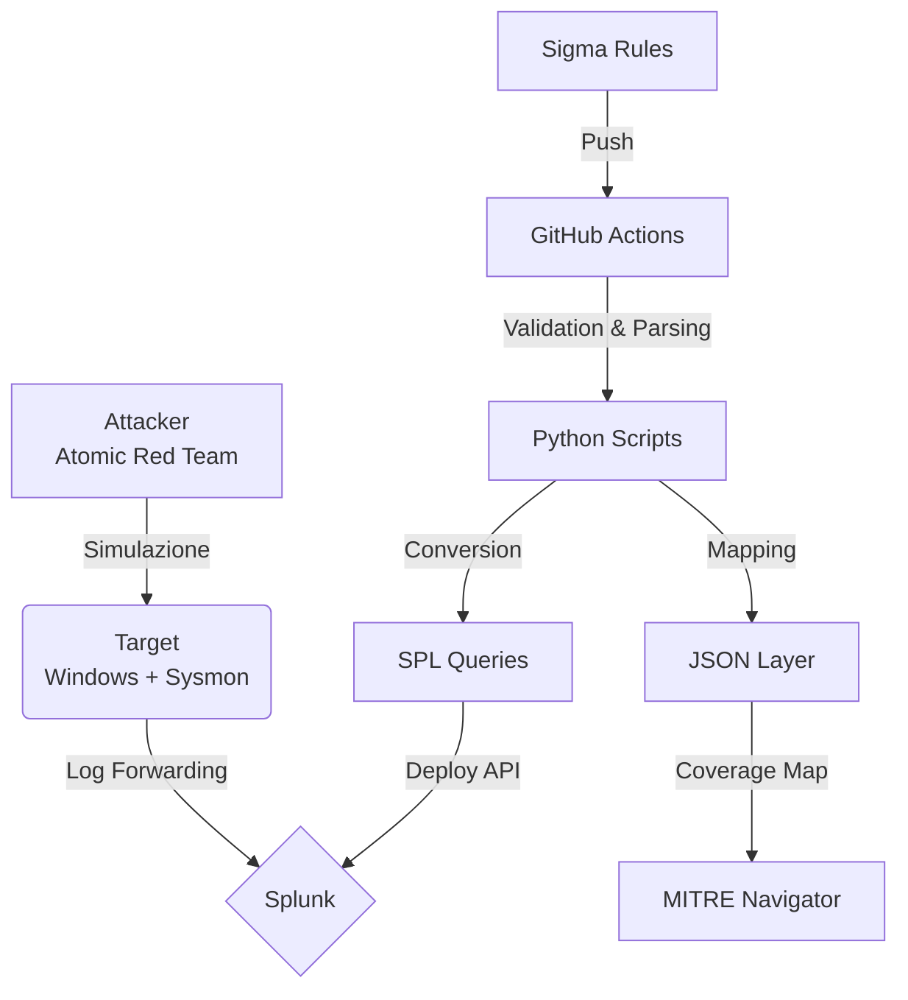

# Detection-as-Code Lab

Questo repository ospita una pipeline **Detection-as-Code (DaC)** automatizzata per la creazione, la conversione e il deployment di regole di sicurezza. Il progetto è una simulazione di un ambiente aziendale che utilizza CI/CD per gestire il ciclo di vita delle detection rule.

## 🏗️ Architettura

## 📊 Stato di Avanzamento

Il progetto è in fase di sviluppo attivo. Di seguito lo stato attuale dei moduli principali:

| Componente | Stato | Dettagli |
| :--- | :--- | :--- |
| **Infrastructure** |  | Lab locale su Fedora (Docker) + VM Windows (Sysmon/UF) configurati. |
| **Automation Scripts** |  | Script Python per estrazione tag e conversione Sigma parzialmente completi. |
| **CI/CD Pipeline** |  | Workflow GitHub Actions base implementato. |
| **Coverage Mapping** |  | Generazione layer JSON completata, integrazione con ATT&CK Navigator in corso. |
| **Rules Deployment** |  | Iniezione automatica su Splunk via REST API in fase di test. |

## 🛠️ Stack

* **SIEM:** Splunk Enterprise
* **Data Collection:** Sysmon (Olaf Hartong Config) + Splunk Universal Forwarder
* **Detection Format:** Sigma Rules
* **Coverage Framework:** MITRE ATT&CK Navigator
* **Simulation:** Atomic Red Team
* **CI/CD:** GitHub Actions

## 📂 Struttura del Repository

* `/rules`: Regole Sigma sorgente.
* `/scripts`: Tooling Python per il mapping delle Techniques ID/generazione JSON layer (`TechniqueExtractor.py`), per la conversione (`Sigma-SPLconverter.py`) e per l'eliminazione delle query (`SavedSearchDeleter.py`).
* `/.github/workflows`: Pipeline di automazione.
